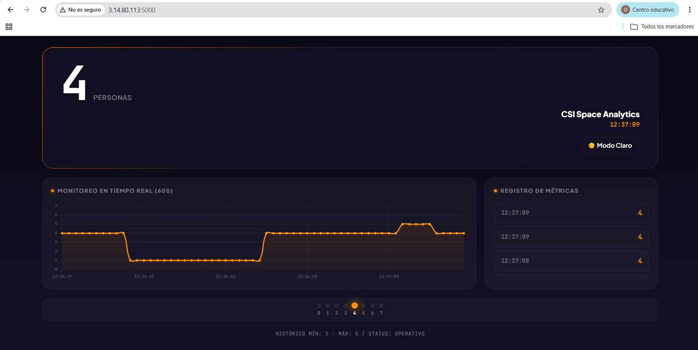

# WiFi CSI People Counter — Pipeline completo: captura + inferencia + dashboard
**Integrantes:** 
- Oscar David Barrientos Huillca - 225419
- Brayan Rodrigo Quispe Castillo - 221986
## Pipeline

```
ESP32 TX  ── WiFi ──>  ESP32 RX  ── UART 460800 ──>  PC (live_predict.py) ──HTTP──> Dashboard web
(active_sta)            (active_ap)                   (model.pkl)                (localhost o AWS)
```

Hardware: 2× ESP32 + 2× cables USB-UART + PC con Linux.



## Entorno de desarrollo

| Componente | Versión |
|------------|---------|
| Python | 3.14+ |
| OS | Linux (Ubuntu 26.04) |
| Firmware | ESP-IDF vía PlatformIO |
| IDE | VS Code (opcional) |

## Instalación

```bash
# Dependencias del sistema
sudo apt-get install -y git wget flex bison gperf python3 python3-pip \
    python3-venv cmake ninja-build ccache libffi-dev libssl-dev dfu-util

# PlatformIO (firmware)
pip install platformio

# Herramientas Python
pip install -r tools/requirements.txt
pip install numpy scikit-learn xgboost flask requests
```

## Flashear firmwares

### 1. ESP32 RX (active_ap) — crea AP `CSI-AP`, captura CSI

```bash
cd firmware/active_ap
pio run --target upload
```

### 2. ESP32 TX (active_sta) — se conecta al AP y envía UDP

```bash
cd firmware/active_sta
pio run --target upload
```

> Conecta un ESP32 a la vez para evitar conflictos de puerto.

## 1. Ver captura CSI en vivo

```bash
python3 tools/serial_monitor.py --port /dev/ttyUSB0 --baud 460800
```

Muestra líneas `CSI_DATA` en tiempo real. Ctrl+C para salir.

## 2. Predicción con ML + Dashboard web

El RX (active_ap) imprime CSI a **460800 baud**. Identificá el puerto correcto (por ej. `/dev/ttyUSB0`).

### Sin dashboard (solo consola)

```bash
python3 tools/live_predict.py /dev/ttyUSB0 460800
```

### Con dashboard web

```bash
# Terminal 1: servidor web
python3 aws_deploy/app.py

# Terminal 2: predictor apuntando al dashboard
python3 tools/live_predict.py /dev/ttyUSB0 460800 --aws-url http://localhost:5000
```

Abrí `http://localhost:5000` en el navegador.

Los datos viajan: ESP32 → serial → `live_predict.py` → HTTP POST → Flask → navegador.

> Si tenés el dashboard desplegado en un servidor remoto, definí `DASHBOARD_URL` en `.env` o pasalo con `--aws-url`.

## 3. Recolectar tu propio dataset

`datos/` está en `.gitignore` porque contiene datos locales (MACs, entorno). Para entrenar tu propio modelo:

1. Colocá los ESP32 en el entorno donde vas a medir
2. Para cada cantidad de personas (0 a 7), grabá ~30s de CSI:
   ```bash
   python3 tools/serial_monitor.py --port /dev/ttyUSB0 --baud 460800 > datos/csi_p0_s1_milab.csv
   ```
3. El archivo debe llamarse `csi_p{personas}_s{session}_{desc}.csv`
4. Repetí para cada valor de 0 a 7 personas

## 4. Entrenar modelo

```bash
python3 tools/train_model.py
```

Entrena RF y XGBoost (clasificación + regresión), elige el mejor y exporta `model.pkl`.
Por defecto: ventanas de 25 líneas, step 10, 8 clases (0-7 personas).

## Estado del proyecto

- ✅ RX inicia automáticamente como AP
- ✅ TX se conecta automáticamente al AP y envía UDP
- ✅ TX genera tráfico UDP a 20 Hz
- ✅ RX imprime `CSI_DATA` a 460800 baud
- ✅ PC visualiza CSI, predice y envía al dashboard web

## Estructura

```
firmware/
├── active_ap/          # Firmware ESP32 RX (Access Point + CSI)
│   └── components/esp32-csi-tool/   # Submodule
└── active_sta/         # Firmware ESP32 TX (Station + UDP)

tools/
├── serial_monitor.py   # Visualización CSI en vivo
├── csi_stats.py        # Diagnóstico de throughput
├── live_predict.py     # Inferencia en tiempo real
├── train_model.py      # Entrenamiento de modelo ML
└── requirements.txt    # Dependencias Python

aws_deploy/
├── app.py              # Servidor Flask (dashboard web)
├── templates/          # HTML del dashboard
└── requirements.txt    # Dependencias Flask

captures/               # Capturas CSI crudas (reservado)
datos/                  # Dataset local (en .gitignore)
model.pkl               # Modelo entrenado localmente (en .gitignore)
```

## Formato CSI_DATA

```
CSI_DATA,role,mac,rssi,rate,sig_mode,mcs,bandwidth,...,len,[valores CSI]
```

Array CSI: pares I/Q (real + imaginario) como enteros con signo separados por espacios.
